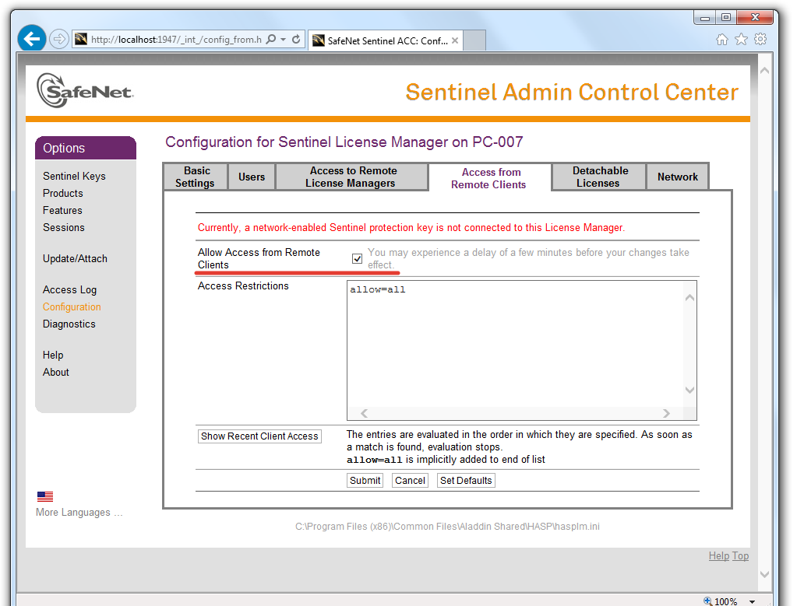
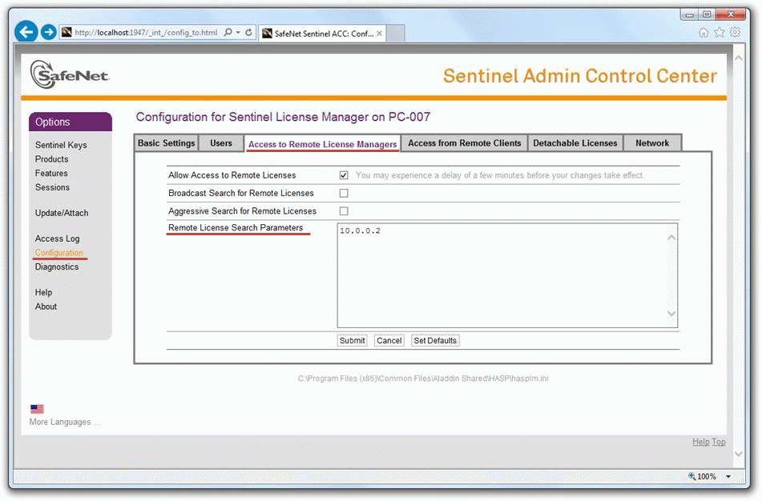
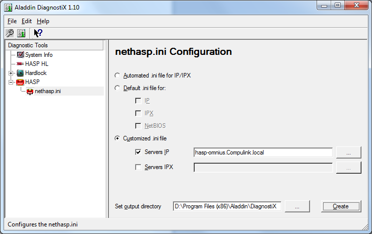
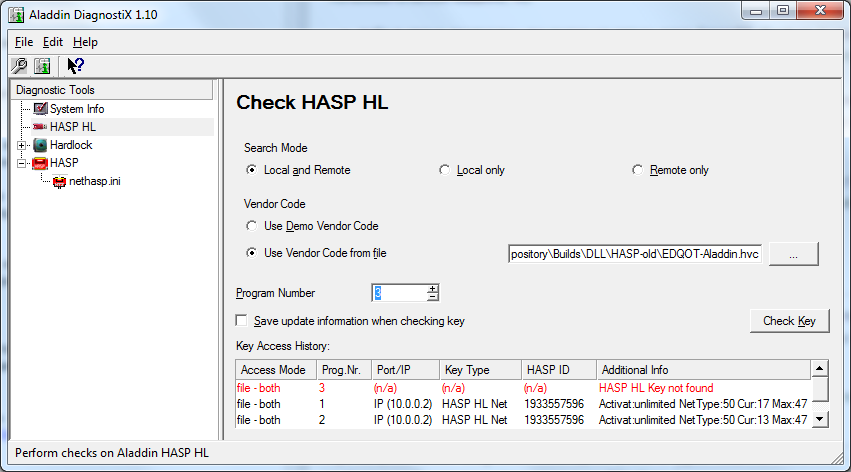
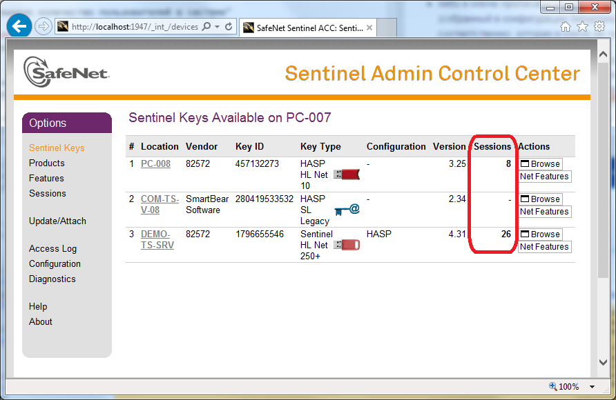
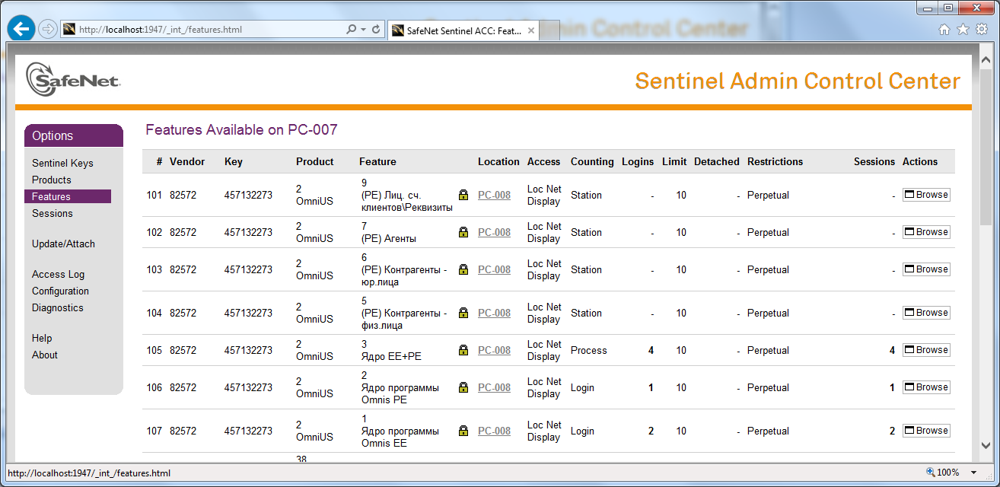

# Использование HASP в АИС Omni-US #
`HASP` (англ. Hardware Against Software Piracy) — это мультиплатформенная аппаратно-программная система защиты программ и данных от незаконного использования и несанкционированного распространения, разработанная компанией Aladdin Knowledge Systems Ltd (с 2009 года - часть SafeNet Inc, с 2014 года SafeNet - часть Gemalto).

Защита HASP включает в себя:

* электронный ключ HASP;
* специальное программное обеспечение для «привязки» к электронному ключу, защиты приложений и для шифрования данных;
* схемы и методы защиты программ и данных, обнаружения и борьбы с отладчиками, контроля целостности программного кода и данных.

Электронные ключи HASP выпускаются в различном виде:

* программный ключ HASP SL
* USB-ключ;
* LPT-ключ с возможностью «прозрачного» подключения других ключей и устройств;
* PCMCIA-карта;
* внутренняя плата стандарта PCI и ISA.

Для защиты Omni-US от несанкционированного распространения и для контроля соблюдения лицензионных соглашений используются USB-ключи HASP HL как "старых" версий Aladdin HASP HL Net (*далее - Aladdin HASP*), так и "новых" Sentinel HL Net (*далее - Sentinel HASP*).

Начиная с Windows Server 2012, поддержка ключей Aladdin HASP ограничена (доступность USB-ключа, подключенного в машину под управлением этой или более новой ОС, не гарантирована), поэтому с 2016 года IServ использует ключи Sentinel HASP.

> С точки зрения конечного пользователя Aladdin HASP и Sentinel HASP отличаются драйверами и инструментами для настройки машин "HASP-сервера" и "HASP-клиентов", но не применением в повседневной работе.

Ключи Aladdin HASP и Sentinel HASP различаются способом указания кода вендора (производителя защищаемого ПО), поэтому клиентское приложение Omnis при запуске определяет, с какой моделью ключа работать, по версии библиотеки `hasp_net_windows.dll`, расположенной в каталоге с приложением; ключи разных поколений, выпущенные IServ, не совместимы между собой (несмотря на совместимость с т.зр. обращения к функциям HASP в целом), т.е. Omnis с новыми драйверами Sentinel не "увидит" старый ключ Aladdin HASP и наоборот.

Вопросы работы с ключами с точки зрения разработчика защищаемого ПО рассмотрены на сайте производителя:

1. [База знаний - Общие вопросы для разработчиков](https://safenet-sentinel.ru/faq/dev/common)
2. [FAQ для Aladdin HASP](https://safenet-sentinel.ru/faq/dev/hl)
3. [FAQ для Sentinel HASP](https://safenet-sentinel.ru/faq/dev/sentinel).

> В данном документе скриншоты могут отличаться от актуального вида изображенных инструментов без потери смысла

## Функции HASP в Omni-US ##
Клиент Omni-US (для работы с юр.лицами OmnisEE.exe или с физ.лицами OmnisPE.exe) при запуске ищет в локальной сети HASP-ключ со "свободной" лицензией, и, если удалось её "занять", анализирует, какие разделы системы (в терминологии HASP - "Feature", например, *"(PE) Контрагенты - физ.лица"*, *"(EE) Отчеты"* и т.д., см Приложение 1) лицензированы и должны быть доступны пользователю (нелицензированные скрываются в интерфейсе пользователя). 

Клиентское приложение может быть скомпилировано в трёх вариантах:

1. NoHASP-версия - вообще не использует функциональность HASP
2. SetupHasp-версия - проверяет наличие свободных лицензий на запуск OmnisEE / OmnisPE (может работать с обоими вариантами ключей - и Aladdin, и Sentinel)
3. SetupHaspExt-версия (только для Sentinel HASP) - проверяет наличие свободных лицензий на запуск любого Omni-US, без разделения на EE и PE

# Настройка машины с ключом #
На машине, где размещен HASP-ключ защиты, необходимо:

## Aladdin HASP ##
1. Разрешить соединения по порту `475` (и UDP и TCP)
2. Установить драйвер (актуальная версия - [на сайте Sentinel по состоянию на 11.09.2018](https://sentinelcustomer.gemalto.com/DownloadNotice.aspx?dID=8589947119), распространяемая с инсталлятором Omnis версия - [`\\fs02\Dev_Repository\Builds\Install HASP drivers\drivers\HASPUserSetup.exe`](file:///\\\fs02\Dev_Repository\Builds\Install%20HASP%20drivers\drivers\HASPUserSetup.exe).
3. Установить и запустить HASP License Manager ([`\\\fs02\Dev_Repository\Builds\Install HASP drivers\HASP_LM_setup\lmsetup.exe`](file:///\\\fs02\Dev_Repository\Builds\Install%20HASP%20drivers\HASP_LM_setup\lmsetup.exe) либо [на сайте Sentinel](https://sentinelcustomer.gemalto.com/DownloadNotice.aspx?dID=8589948742)) - специальное приложение Aladdin, осуществляющее обмен данными между USB-ключом и защищенным приложением (далее - *HASP LM*).

## Sentinel HASP ##
1. Разрешить соединения по порту `1947` (и UDP и TCP)
2. Установить драйвер Sentinel HASP Run time Environment (актуальная версия - [на сайте Sentinel по состоянию на 11.09.2018](https://sentinelcustomer.gemalto.com/DownloadNotice.aspx?dID=8589947119), в локальной сети - [`\\\fs02\Dev_Repository\Builds\Install HASP drivers\! New\Sentinel_LDK_Run-time_setup.zip`](file:///\\\fs02\Dev_Repository\Builds\Install%20HASP%20drivers\!%20New\Sentinel_LDK_Run-time_setup.zip))
3. Запустить консоль управления Sentinel Admin Control Center, перейдя в браузере по адресу [http://localhost:1947](http://localhost:1947), и разрешить удаленные подключения на вкладке [Access from Remote Clients](http://localhost:1947/_int_/config_from.html):

## Дополнительно ##
Для работы ключей Aladdin HASP по сети в любом случае необходим запуск HASP License Manager, но драйвер может быть использован и современный (Sentinel HASP Run time Environment), т.к. он успешно обеспечивает работу USB-ключа как устройства HASP.

Таким образом, на одной машине с одним драйвером могут одновременно работать оба вида ключей.

# Настройка пользовательской машины #
## Aladdin HASP ##
1. Разрешить соединения по порту `475` (и UDP и TCP)
2. Убедиться, что рядом с исполняемым файлом OmnisEE.exe / OmnisPE.exe расположена клиентская библиотека HASP `hasp_net_windows.dll` (HASP HL Assembly for Microsoft.Net) производителя Aladdin Knowledge Systems Ltd. (в локальной сети - [`\\\fs02\Dev_Repository\Builds\DLL\hasp_net_windows.dll`](file:///\\\fs02\Dev_Repository\Builds\DLL\hasp_net_windows.dll), а также библиотека `haspenv.dll` (HASP HL Envelope Runtime for Microsoft.Net) того же производителя (в локальной сети - [`\\\fs02\Dev_Repository\Builds\DLL\haspenv.dll`](file:///\\\fs02\Dev_Repository\Builds\DLL\haspenv.dll)) 
3. Настроить файл `nethasp.ini`

### Настройка nethasp.ini ###
В файле конфигурации клиента Aladdin HASP настраивается процесс поиска клиентом экземпляра HASP License Manager.

Клиентское приложение при старте ищет файл конфигурации в следующем порядке каталогов:

- директория, где находится исполняемый файл
- текущая директория
- системная директория Windows
- директория Windows

Если файл конфигурации не найден, используется поиск HASP LM широковещательными запросами.

Для работы клиента Omni-US минимально достаточен следующий набор настроек в файле конфигурации:

	[NH_COMMON]
	NH_TCPIP = Enabled
	NH_IPX = Disabled
	[NH_TCPIP]
	NH_SERVER_ADDR = 192.168.17.100
	NH_USE_BROADCAST = Disabled

где

- `[NH_COMMON]` - раздел общих настроек
- `NH_TCPIP = Enabled` - включение протокола TCP/IP
- `NH_IPX = Disabled` - отключение проткола IPX
- `[NH_TCPIP]` - раздел настроек для протокола TCP/IP
- `NH_SERVER_ADDR = 192.168.17.100` - адрес машины с HASP LM (может быть указан как IP-адрес, так и имя машины) 
- `NH_USE_BROADCAST = Disabled` - отключение широковещательных запросов поиска HASP LM

Подробные сведения о конфигурационном файле приведены в Приложении 2.

## Sentinel HASP ##
1. Разрешить соединения по порту `1947` (и UDP и TCP)
2. Убедиться, что рядом с исполняемым файлом OmnisEE.exe / OmnisPE.exe расположена клиентская библиотека HASP `hasp_net_windows.dll` (Sentinel LDK Assembly for Microsoft.Net) производителя SafeNet, Inc., а также библиотеки, привязанные к поставщику ПО IServ - `apidsp_windows.dll`, `hasp_windows_82572.dll`, `haspvlib_82572.dll` (в локальной сети - [`\\fs02\Dev_Repository\Builds\DLL\HASP-new\new-hasp-dlls.zip`](file:///\\\fs02\Dev_Repository\Builds\DLL\HASP-new\new-hasp-dlls.zip))

Если в локальной сети запрещены широковещательные запросы и/или машина с ключом находится в другой подсети, чем машина пользователя, необходимо

3. установить драйвер Sentinel HASP Run time Environment (актуальная версия - [на сайте Sentinel](https://sentinelcustomer.gemalto.com/sentineldownloads/?s=&c=End+User&p=Sentinel+HASP&o=Windows&t=Runtime+%26+Device+Driver&l=all), в локальной сети - [`\\fs02\Dev_Repository\Builds\Install HASP drivers\! New\Sentinel_LDK_Run-time_setup.zip`](file:///\\\fs02\Dev_Repository\Builds\Install%20HASP%20drivers\!%20New\Sentinel_LDK_Run-time_setup.zip))
4. запустить на пользовательской машине консоль управления Sentinel Admin Control Center перейдя в браузере по адресу [http://localhost:1947](http://localhost:1947)
5. Указать адрес "HASP-сервера" на вкладке [Access to Remote License Managers](http://localhost:1947/_int_/config_to.html) в поле `Remote License Search Parameters`:
, отключить широковещательные запросы (снять флаг "`Broadcast Search for Remote Licenses`"), если broadcast пакеты не обрабатываются; разрешить поиск ключей по сети (включить флаг "`Allow Access to Remote Licenses`"), если он по какой-либо причине ещё не разрешен.

# Запись USB-ключа HASP #
Запись лицензируемых параметров на USB-ключ осуществляется IServ либо непосредственно на ключ при наличии физического доступа к нему, либо в специальный файл *.V2C, который заказчик Omni-US самостоятельно применяет к ключу.

Для записи помимо специального ПО необходим "мастер-ключ" (содержит уникальные
коды и идентификаторы, которые присваиваются IServ как вендору - производителю ПО - компанией SafeNet; записывается поставщиком ООО "АМ Софт"):

- белый с надписью "MASTER HASP HL" для Aladdin HASP
- синий с надписью "Sentinel LDK Master" и наклейкой "Master 4.27 EDQOT 04.16" на обратной стороне для Sentinel HASP

Коды IServ как вендора (подробнее понятие раскрывается [в FAQ на сайте Sentinel](https://safenet-sentinel.ru/faq/dev/common#6395)):

- `82572`
- `EDQOT`

Также от заказчика ключа необходимы сведения о лицензионных ограничениях (если есть): доступные функции Omni-US (см список в Приложении 1) и допустимое количество одновременно запущенных копий приложения.

## Aladdin HASP ##
Для записи ключа Aladdin HASP нужны:

1. Белый мастер-ключ
2. Утилита Factory из состава [Sentinel HASP SDK](https://sentinelcustomer.gemalto.com/DownloadNotice.aspx?dID=8589943837) 

## Sentinel HASP ##
Для записи ключа Sentinel HASP нужны:

1. Синий мастер-ключ
2. Sentinel EMS (Entitlement Management System) из состава [Sentinel LDK SDK ](https://sentinelcustomer.gemalto.com/DownloadNotice.aspx?dID=8589947463)
3. [Руководство по использованию Sentinel EMS](https://safenet-sentinel.ru/files/sentinel_ldk_manual_ru.pdf)

# Известные экземпляры ключей #
В настоящее время в локальной сети IServ доступны следующие ключи:

1. `hasp-omnius.compulink.local` - Aladdin HASP, серийный номер `1933557596`, 50 лицензий OmnisEE, 50 лицензий OmnisPE
2. `pc-008.compulink.local` - Sentinel HASP, серийный номер `457132273`, 10 лицензий Omnis (*для OmnisEE.exe/OmnisPE.exe, собранных в конфигурации SetupHaspExt*), 10 лицензий OmnisEE, 10 лицензий OmnisPE
3. `hasp-omnius.compulink.local` - Sentinel HASP, серийный номер `724415323`, безлимитные лицензии Omnis (*для OmnisEE.exe/OmnisPE.exe, собранных в конфигурации SetupHaspExt*), OmnisEE, OmnisPE

# Решение проблем #
С точки зрения пользователя проблема с HASP выражается в сообщении об ошибке при запуске клиентского приложения Omni-US, основные рассмотрены в данном документе:

- "Запрошенная функция недоступна"
- "Ключ HASP HL недоступен или превышено количество пользователей в системе"

## Запрошенная функция недоступна ##
Сообщение "Запрошенная функция недоступна" отображается в случаях, когда HASP-ключ Omni-US доступен на пользовательской машине, но:

- либо в ключе прописаны лицензии на запуск ядра OmnisEE (Feature 1) и/или ядра OmnisPE (Feature 2), а клиент (собранный в конфигурации SetupHaspExt) запрашивает лицензию на запуск ядра EE+PE (Feature 3), которая в ключе не прописана
- либо в ключе прописана лицензия на запуск ядра EE+PE (Feature 3), а клиент OmnisEE.exe или OmnisPE.exe (собранный в конфигурации SetupHasp) запрашивает лицензию на запуск ядра OmnisEE или OmnisPE соответственно, которая в ключе не прописана

Вопрос решается настройкой доступа к подходящему ключу HASP, если он есть, либо записью правильного ключа HASP, либо сборкой клиентского приложения в правильной конфигурации (SetupHasp или SetupHaspExt) в зависимости от действующего с потребителем лицензионного договора.

## Ключ HASP HL недоступен ##
Сообщение "Ключ HASP HL недоступен или превышено количество пользователей в системе" отображается в случае, когда ключ недоступен, либо доступен, но количество пользователей, уже "занявших" лицензию Omnis, действительно достигло лицензированного предела.

### Aladdin HASP ###
В случае с Aladdin HASP доступность ключа и количество активных подключений можно увидеть с помощью утилиты Aladdin DiagnostiX ([http://safenet-sentinel.ru/files/diagnostix_installer.zip](http://safenet-sentinel.ru/files/diagnostix_installer.zip), в локальной сети - [`\\\fs02\Dev_Repository\Builds\DLL\HASP-old\DiagnostiX_Installer.zip`](file:///\\\fs02\Dev_Repository\Builds\DLL\HASP-old\DiagnostiX_Installer.zip)).

При запуске Aladdin DiagnostiX необходимо указать адрес машины с ключом:

файл с информацией о вендоре (производителе ПО) IServ (в локальной сети - [`\\fs02\Dev_Repository\Builds\DLL\HASP-old\EDQOT-Aladdin.hvc`](file:///\\\fs02\Dev_Repository\Builds\DLL\HASP-old\EDQOT-Aladdin.hvc)) и номер (Program Number) запрашиваемой функции (Feature). Если лицензия с заданными параметрами доступна, отобразится информация об общем количестве доступных подключений и о текущем использованном количестве:
  

### Sentinel HASP ###
В случае с Sentinel HASP количество активных подключений отображается в консоли управления Sentinel Admin Control Center ([http://localhost:1947](http://localhost:1947)) на вкладке [Sentinel Keys](http://localhost:1947/_int_/devices.html):

Для просмотра доступных на данной машине функций (Feature) Omni-US необходимо перейти на вкладку [Features](http://localhost:1947/_int_/features.html):

На приведенном скриншоте видны функции №№1, 2, 3, прописанные на USB-ключе, размещенном на машине PC-008, причем:

- из 10 лицензий Ядра EE+PE (Feature 3) использовано 4 (т.е. запущено 4 экземпляра клиентского приложения OmnisEE/OmnisPE, собранного в конфигурации SetupHaspExt)
- из 10 лицензий ядра Omnis EE (Feature 1) использовано 2 (т.е. запущено 2 экземпляра приложения OmnisEE.exe, собранного в конфигурации SetupHasp)
- из 10 лицензий ядра Omnis PE (Feature 2) использована 1 (т.е. запущен 1 экземпляр приложения OmnisPE.exe, собранного в конфигурации SetupHasp)  

### Решение проблемы недоступности ключа ###
1. Проверить, что на машине, где физически размещён ключ, установлены драйвера HASP соответствующей версии
2. Убедиться, что HASP-ключ доступен локально на машине, где он размещён (с помощью Aladdin DiagnostiX либо Sentinel Admin Control Center)
3. Разрешить соединения по UDP и TCP портам 475 (Aladdin HASP) или 1947 (Sentinel HASP) и на машине с ключом, и на машине пользователя
4. В случае с Aladdin HASP проверить, что на машине с ключом запущен HASP License Manager (как служба либо как отдельное приложение), и настройки используемых протоколов совпадают с клиентскими
5. В случае с Sentinel HASP проверить, что на машине с ключом разрешены удаленные обращения (вкладка [Access from Remote Clients](http://localhost:1947/_int_/config_from.html)) к ключу
6. Убедиться, что версия клиентской библиотеки `hasp_net_windows.dll`, расположенной в каталоге с запускаемым клиентским приложением OmnisEE.exe/OmnisPE.exe, совпадает с используемой версией ключа ([`\\\fs02\Dev_Repository\Builds\DLL\hasp_net_windows.dll`](file:///\\\fs02\Dev_Repository\Builds\DLL\hasp_net_windows.dll) и [`\\\fs02\Dev_Repository\Builds\DLL\haspenv.dll`](file:///\\\fs02\Dev_Repository\Builds\DLL\haspenv.dll) для Aladdin HASP, [`\\\fs02\Dev_Repository\Builds\DLL\HASP-new\new-hasp-dlls.zip`](file:///\\\fs02\Dev_Repository\Builds\DLL\HASP-new\new-hasp-dlls.zip) для Sentinel HASP)
7. В случае с Aladdin HASP проверить настройки в файле конфигурации `nethasp.ini` в каталоге с запускаемым клиентским приложением OmnisEE.exe/OmnisPE.exe (актуальный файл для локальной сети IServ - [`\\\fs02\Dev_Repository\Builds\Install Omnis Server\nethasp.ini`](file:///\\\fs02\Dev_Repository\Builds\Install%20Omnis%20Server\nethasp.ini))
8. В случае с Sentinel HASP проверить в Sentinel Admin Control Center, что адрес машины с ключом указан на вкладке [Access to Remote License Managers](http://localhost:1947/_int_/config_to.html) в поле `Remote License Search Parameters` и поиск ключей по сети включен (флаг "`Allow Access to Remote Licenses`")   

# Приложение 1. Лицензируемые функции Omni-US #
При запуске клиентское приложение в зависимости от конфигурации сборки (SetupHasp или SetupHaspExt) запрашивает лицензию на одну из трёх функций (в скобках - номер Feature):
 
1. Ядро программы Omnis EE (1)
2. Ядро программы Omnis PE (2)
3. Ядро EE+PE (3)

Затем главное меню клиентского приложения может быть ограничено в зависимости от наличия доступных лицензий на следующие разделы (в скобках - номер Feature):

- (PE) Контрагенты физ.лица (5)
- (PE) Контрагенты юр.лица (6)
- (PE) Агенты (7)
- (PE) Лиц. сч. клиентов\Реквизиты (9)
- (PE) Лиц. сч. клиентов\Услуги (10)
- (PE) Лиц. сч. клиентов\Персональный учет (11)
- (PE) Лиц. сч. клиентов\Счета (12)
- (PE) Лиц. сч. клиентов\Оплаты (13)
- (PE) Лиц. сч. поставщиков\Реквизиты (17)
- (PE) Лиц. сч. поставщиков\Технический учет (18)
- (PE) Лиц. сч. поставщиков\Услуги (19)
- (PE) Лиц. сч. поставщиков\Счета (20)
- (PE) Лиц. сч. поставщиков\Оплаты (21)
- (PE) Лиц. сч. поставщиков\Доп.\Документы (22)
- (PE) Лиц. сч. поставщиков\Доп.\Задолженности (23)
- (PE) Питающая схема (24)
- (PE) Коммунальные объекты (25)
- (PE) Установка приборов учета (26)
- (PE) События персонального учета (27)
- (PE) Квартирный фонд (28)
- (PE) Реестры начислений (29)
- (PE) Начисления (30)
- (PE) Реестры вх.платежей (31)
- (PE) Невыясненные суммы (32)
- (PE) Вх. платежи (33)
- (PE) Начисления поставщиков (34)
- (PE) Исх. платежи (35)
- (PE) Состояние расчетов с абонентами (36)
- (PE) Дебиторы-Кредиторы (37)
- (PE) Обороты по номенклатурам (38)
- (PE) Документы на отключение услуг (39)
- (PE) Журнал задолженности (40)
- (PE) Журнал проводок (41)
- (PE) Акты съема показаний (42)
- (PE) Актовые суммы (43)
- (PE) Входящие документы (Документооборот) (44)
- (PE) Исходящие документы (Документооборот) (45)
- (PE) Журнал операций (46)
- (PE) Выполнить расчет (47)
- (PE) Разнести документы (48)
- (PE) Удалить разноски (49)
- (PE) Подвести итог за период (50)
- (PE) Проведение документов (51)
- (PE) Фактурирование платежей (52)
- (PE) Расчет с поставщиками (53)
- (PE) Отчеты (54)
- (PE) Справочники (55)
- (PE) Настройка сбытовой организации (56)
- (PE) Администрирование (57)
- (PE) Настройка отчетов (58)
- (PE) Настройка невыясненных сумм (59)
- (PE) Финансы (60)
- (EE) Контрагенты физ.лица (62)
- (EE) Контрагенты юр.лица (63)
- (EE) Агенты (64)
- (EE) Лиц. сч. клиентов\Реквизиты (65)
- (EE) Лиц. сч. клиентов\Услуги (66)
- (EE) Лиц. сч. клиентов\Технический учет (67)
- (EE) Лиц. сч. клиентов\Профили нагрузок (68)
- (EE) Лиц. сч. клиентов\Доп.\Документы (69)
- (EE) Лиц. сч. клиентов\Доп.\Не рассчит. периоды (70)
- (EE) Лиц. сч. клиентов\Доп.\Задолженности (71)
- (EE) Лиц. сч. поставщиков\Реквизиты (72)
- (EE) Лиц. сч. поставщиков\Технический учет (73)
- (EE) Лиц. сч. поставщиков\Услуги (74)
- (EE) Лиц. сч. поставщиков\Счета (75)
- (EE) Лиц. сч. поставщиков\Оплаты (76)
- (EE) Лиц. сч. поставщиков\Доп.\Документы (77)
- (EE) Лиц. сч. поставщиков\Доп.\Задолженности (78)
- (EE) Питающая схема (79)
- (EE) Коммунальные объекты (80)
- (EE) Установка приборов учета (81)
- (EE) Реестры начислений (82)
- (EE) Начисления (83)
- (EE) Реестры вх.платежей (84)
- (EE) Невыясненные суммы (85)
- (EE) Вх. платежи (86)
- (EE) Состояние расчетов с абонентами (87)
- (EE) Дебиторы-Кредиторы (88)
- (EE) Журнал задолженности (89)
- (EE) Журнал проводок (90)
- (EE) Акты съема показаний (91)
- (EE) Профили нагрузок (92)
- (EE) Актовые суммы (93)
- (EE) Входящие документы (Документооборот) (94)
- (EE) Исходящие документы (Документооборот) (95)
- (EE) Журнал операций (96)
- (EE) Выполнить расчет (97)
- (EE) Разнести документы (98)
- (EE) Удалить разноски (99)
- (EE) Подвести итог за период (100)
- (EE) Фактурирование платежей (101)
- (EE) Отчеты (102)
- (EE) Справочники (103)
- (EE) Настройка сбытовой организации (104)
- (EE) Адмистрирование (105)
- (EE) Настройка отчетов (106)
- (EE) Настройка невыясненных сумм (107)
- (EE) Расчетные ведомости (108)
- (EE) Новый платеж (109)
- (EE) Ограничения энергоснабжения (110)
- (EE) Выполнить расчет (балансовый метод) (111)
- (EE) Финансы (112)

# Приложение 2. Сведения о файле конфигурации nethasp.ini #
Конфигурационный файл nethasp.ini состоит из четырех секций, каждая из которых является необязательной:

- `[NH_COMMON]` для общих настроек
- `[NH_IPX]` для протокола IPX
- `[NH_NETBIOS]` для протокола NetBios
- `[NH_TCPIP]` для протокола TCP/IP

Секция `[NH_COMMON]` содержит глобальные настройки для всех секций конфигурационного файла. Каждая из остальных секций содержит настройки, регулирующие операции конкретного протокола.

В каждой секции могут быть заданы общие ключевые слова и/или ключевые слова, применяемые только в данной
секции. Если общее ключевое слово задано в секции какого-либо из протоколов, для данного протокола данная настройка будет иметь приоритет по сравнению со значением в секции `[NH_COMMON]`.

Символ «;» в начале строки является признаком закомментированной строки, такая строка не обрабатывается.

## Общие ключевые слова ##
- `nh_session` - максимальный период времени, в течение которого защищенное приложение будет пытаться установить соединение с HASP LM. Возможное значение: <число>. По умолчанию – 2 секунды.
- `nh_send_rcv` - максимальный период времени для HASP LM на получение и передачу пакетов. Возможное значение: <число>. По умолчанию – 1 секунда.

## Ключевые слова только для секции `[NH_COMMON]` ##
- `nh_ipx` - использовать протокол IPX? Возможные значения: `enabled`, `disabled`.
- `nh_netbios` - использовать протокол NETBIOS? Возможные значения: `enabled`, `disabled`.
- `nh_tcpip` - использовать протокол TCP/IP? Возможные значения: `enabled`, `disabled`.

## Ключевые слова только для секции [NH_IPX] ##
- `nh_use_bindery` - использовать IPX с bindery (содержит имена и пароли пользователей для авторизации при регистрации на даном компьютере). Данный ключ заменяет ранее использовавшийся ключ `NH_USE_SAP`. Возможные значения: `enabled`, `disabled`. По умолчанию – `disabled`.
- `nh_use_broadcast` - ипользовать механизм широковещания IPX. Возможные значения: `enabled`, `disabled`. По умолчанию – `enabled`.
- `nh_bc_socket_num` - номер сокета для механизма широковещания. Возможное значение: <шестнадцатиричное
число>. По умолчанию – `7483H`.
- `nh_use_int` - возможные значения: `2F_NEW`, `7A_OLD`. По умолчанию – `2F_NEW`, означает, что
протокол IPX будет использовать ТОЛЬКО прерывание 2Fh. `7F_OLD` означает, что протокол IPX
будет использовать ТОЛЬКО прерывание 7Ah.
- `nh_server_name` - имя экземпляра HASP LM. Максимальное количество имен – 6, максимальная длина имени – 7 символов (не является регистрозависимым).
- `nh_search_method` - как защищенное приложение будет общаться с HASP LM: в локальной сети или в интернет. Возможные значения: `localnet`, `internet`. По умолчанию - `internet`.
- `nh_datfile_path` - расположение адресного файла HASP LM

## Ключевые слова только для секции `[NH_NETBIOS]` ##
- `nh_nbname` - имя экземпляра HASP LM. Максимальное количество имен – одно, максимальное количество символов – 8 (не является регистрозависимым).
- `nh_uselananum` - номер канала коммуникации.

## Ключевые слова только для секции `[NH_TCPIP]` ##
- `nh_server_addr` - IP-адреса всех необходимых менеджеров лицензий HASP. Количество адресов не
ограничено, возможно перечисление в несколько строк. Формат задания IP-адреса: `192.114.176.65` или `ftp.aladdin.co.il`
- `nh_server_name` - имя экземпляра HASP LM. Максимальное количество имен – 6, максимальная длина имени – 7 символов (не является регистрозависимым).
- `nh_port_number` - номер порта для протокола TCP/IP (опционально). По
умолчанию – `475`.
- `nh_tcpip_method` - метод отправки пакетов – TCP или UDP. Возможные значения: `TCP`, `UDP`. По умолчанию – `UDP`.
- `nh_use_broadcast` - использовать широковещательный механизм UDP. Возможное значение: `enabled`, `disabled`. По умолчанию – `enabled`.
